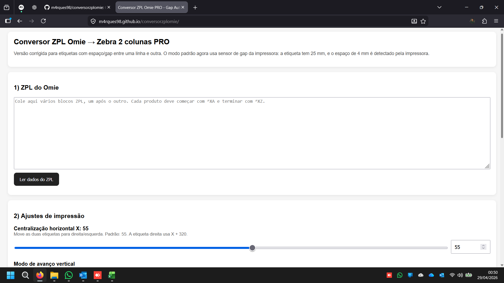

# 🏷️ Conversor ZPL Omie → Etiquetas 2 Colunas

Ferramenta web para converter automaticamente códigos ZPL do Omie em etiquetas otimizadas para impressão em duas colunas (esquerda e direita).

## 🚀 O que faz

- Leitura automática do código ZPL gerado pelo Omie
- Extração de:
  - Nome do produto
  - Código de barras
  - Preço
- Permite edição manual antes da conversão:
  - Nome (abreviação)
  - Código
  - Preço
- Ajuste fino de impressão:
  - Centralização horizontal
  - Ajuste vertical (alinhamento das etiquetas)
- Suporte a múltiplos produtos
- Definição de quantidade de etiquetas por item
- Geração automática do ZPL final pronto para impressão

## 🖥️ Acesso

👉 https://m4rques98.github.io/conversorzplomie/

## 📄 Como usar

1. Cole o código ZPL exportado do Omie
2. Clique para **ler os dados**
3. Revise os produtos:
   - Ajuste nome (se necessário)
   - Confira preço e código
   - Defina quantidade de etiquetas
4. Ajuste alinhamento (se necessário)
5. Clique em **Gerar ZPL**
6. Envie para a impressora

## 🏷️ Layout das etiquetas

- 2 etiquetas por linha (esquerda e direita)
- Código de barras centralizado
- Nome abreviado automaticamente se necessário
- Preço em destaque
- Espaçamento ajustado para bobinas com gap

## ⚙️ Recursos técnicos

- Controle de avanço vertical (corrige desalinhamento entre etiquetas)
- Evita corte de conteúdo em múltiplas linhas
- Compatível com impressoras Zebra (ZPL)

## 🖼️ Preview

## 📌 Observações

- Ajuste fino pode variar conforme:
  - Modelo da impressora
  - Tipo de etiqueta
  - Configuração de gap

- Recomendado fazer teste de impressão inicial

---

**Desenvolvido por Marques Tech 🚀**
